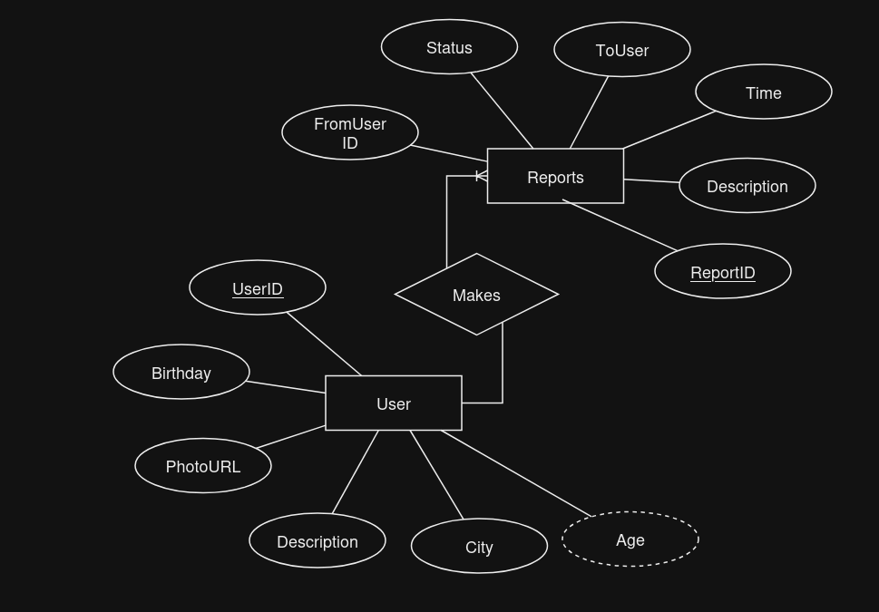
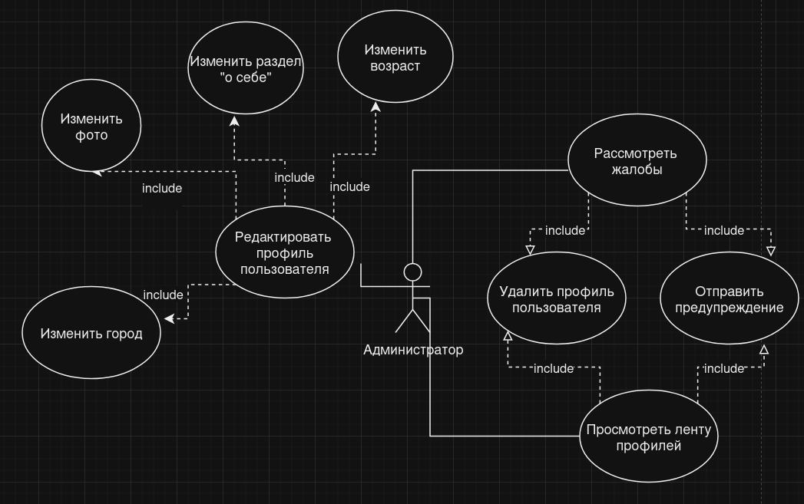
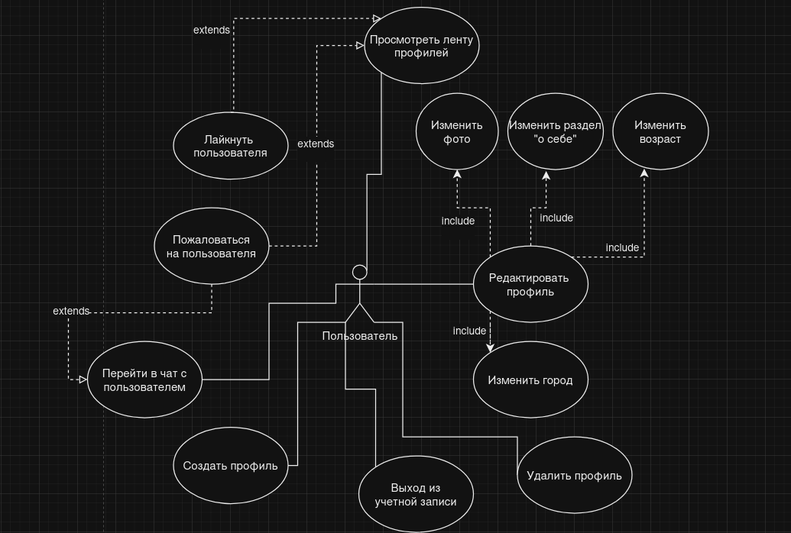
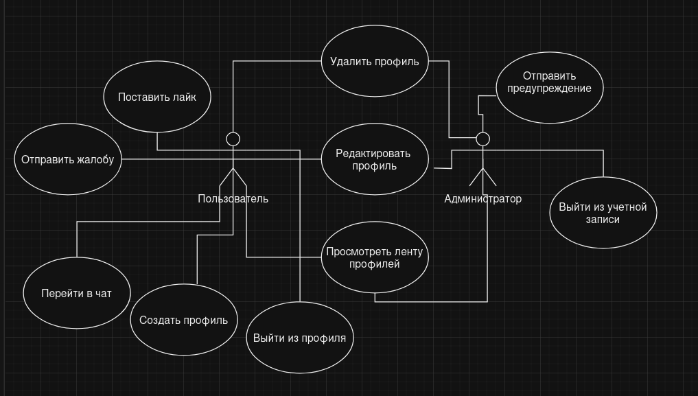

# ISLAMEET

Современное приложение для знакомств 

# Стек технологий:
  Dart Conduit
  - Database: PostgreSQL

# ER-диаграмма

# Роли пользователей

# API Сервера:
| HTTP Метод | Эндпоинт              | Описание                                 |
|------------|-----------------------|------------------------------------------|
| POST       | /token                | Авторизация (вход)                       |
| PUT        | /token                | Регистрация (создание пользователя)      |
| DELETE     | /token                | Удаление пользователя                    |
| POST       | /token/{refresh}      | Обновление токена                        |
| GET        | /user                 | Получить профиль текущего пользователя   |
| POST       | /user                 | Обновить профиль текущего пользователя   |
| PUT        | /user                 | Обновить пароль                          |
| GET        | /user/{all}           | Получить все профили                     |
| GET        | /chat                 | Получить чаты по ID                      |

# Swagger
Текущая документация описана в файле auth/swagger.json. UI доступен, например, с использованием сервиса https://editor.swagger.io/. Нужно лишь вставить туда содержимое файла swagger.json

# Сетевое взаимодействие
Сетевое взаимодействие осуществляется с использованием виртуальной сети через Hamachi. Устройство с развернутым клиентом подключается к сети, созданной с устройства, на котором развернут сервер.
